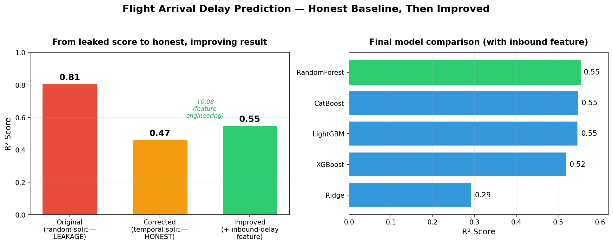

# Flight Arrival Delay Prediction

Predict how many minutes late an American Airlines flight out of DFW will
**arrive**, using only information available **before it departs**.



> **The story of this project, in one line:** the original notebook reported
> **R² = 0.81** — but that was a data-leakage illusion. After fixing it, the honest
> baseline was **R² = 0.47**; a domain-driven feature then lifted it to **R² = 0.55**.
> Rigor first, then real improvement.

---

## Results

Full dataset, temporal 80/20 split (train on the past, predict the future):

| Model | R² | RMSE (min) | MAE (min) |
|---|---|---|---|
| **RandomForest** (champion) | **0.55** | 56.3 | 33.1 |
| CatBoost | 0.55 | 56.7 | 33.2 |
| LightGBM | 0.55 | 56.7 | 33.2 |
| XGBoost | 0.52 | 58.4 | 33.9 |
| Ridge (linear baseline) | 0.29 | 70.9 | 44.3 |

The champion's predictions are off by ~33 minutes on average (MAE). The four tree
models agreeing closely confirms the signal is real, not a fluke.

---

## Two findings that make this project

### 1. A data-leakage bug was inflating the original score by 0.34

The original approach split the data **randomly**. For a problem where you predict
*before* a flight departs, that lets the model train on future flights and test on
past ones — leakage. Switching to a **temporal split** dropped the score from a
fake 0.81 to an honest **0.47**. Same models, same data — the 0.34 gap *was* the bug.

### 2. A delay-propagation feature then lifted it to 0.55

The strongest real-world predictor of a departure delay is the state of the
*previous* flight flown by the same physical aircraft — if the plane arrives late,
the next leg leaves late. Adding an **inbound-aircraft-delay** feature raised R² from
0.47 to **0.55** and cut average error by **5.5 minutes**.

Crucially, this feature respects the same anti-leakage discipline: the inbound leg's
delay is only used when that flight had **actually landed before the current flight's
scheduled departure** — knowable at prediction time. That condition held for **47.7%**
of flights; for the rest, the feature is correctly marked unknown rather than leaked.

---

## What the model uses

Pre-departure-safe features only: scheduled times (exploded into hour, day, month,
day-of-week, season), destination airport, aircraft fleet type, scheduled duration,
hourly destination weather, and the leakage-guarded inbound-aircraft delay.

Columns recorded *after* the flight (actual times, delay reason codes, status flags)
are explicitly excluded.

---

## Project structure

```
flight-delay-prediction/
├── config/config.yaml      # every parameter, path, and model lives here
├── src/
│   ├── data/               # load, clean, temporal split
│   ├── features/           # time, weather, delay-propagation, leakage-safe preprocessing
│   └── models/             # config-driven model registry, train/evaluate
├── scripts/run_pipeline.py # one-command entry point
├── tests/                  # unit tests for the leakage-sensitive steps
└── artifacts/              # saved model + leaderboard + chart (generated)
```

Config-driven: behaviour changes by editing `config.yaml`, never by editing source.
Add a model by pasting a YAML block; toggle the propagation feature with one flag.

---

## Run it

```bash
python3 -m venv .venv && source .venv/bin/activate
pip install -r requirements.txt
# place the raw flight CSV at data/raw/flights.csv
python -m scripts.run_pipeline
pytest -q
```

Results write to `artifacts/reports/`; the champion model to `artifacts/models/`.

---

## Known limitations (documented, not hidden)

1. **Weather is observed, not forecast** — a production version needs the forecast
   available at scheduling time.
2. **Destination limited to 10 airports** by the weather-coordinate lookup, which
   drops a large share of rows. Expanding this is the next scaling step.
3. **Target quality** — the raw delay distribution has an implausibly high mean; the
   pipeline drops out-of-range values, but upstream timestamp logic should be verified.

---

## Next steps

- Serve the model behind a small API (FastAPI) for real-time predictions.
- Reframe as classification ("will this flight be >15 min late?") for a more
  operationally useful metric.
